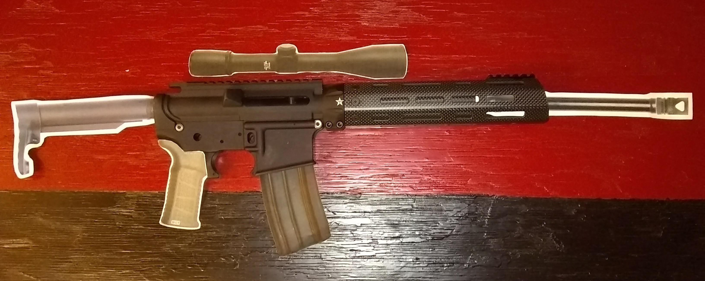

The ultimate purpose of the [GridScout™][gridscout] map-search tool is to
provide for a better community defense. For that same purpose, I'm building a
new firearm. I call it the RC1. Why RC1? Because it's easier to explain that
RC1 stands for Reeder Carbine #1 than to explain that PK6 (my original name for
the RC1 concept) stands for _Piŝta Karabeno je 6,5 Grendel_.

## Firearm design
My intent is to create a weapon that is well suited for all ranges from 0 to
300 yards and easy to operate in close quarters. The barrel will be just long
enough to avoid the red tape associated with a short-barreled rifle. This
length also serves to keep the muzzle velocity high enough for medium-range
use. If I put a muzzle brake on it, it'll be a short, single-chamber model that
minimizes the added weight and length.

The RC1 will have a very short, fixed-length buttstock. This would make it
uncomfortable with the standard 33° grip angle, so its pistol grip will instead
be nearly vertical. This will place the wrist of the shooter's dominant hand in
a neutral position, while the short length of pull will put the entire mass of
the RC1 closer to the shooter's body where it is more easily supported. The gun
is intended to be as lightweight as practical in order to further limit muscle
fatigue, as even minor fatigue can affect the steadiness with which the shooter
holds his sights on target.

The RC1 will be based largely on the Alexander 6.5 Grendel Incursion, which is
relatively light and fires the most effective general-purpose cartridge yet
devised for AR15-format firearms. Thanks to the versatility and popularity of
Eugene Stoner's modular design —the Armalite AR-15 upon which the Grendel
Incursion and many other modern weapons are based—, we now have a standardized
means of interchanging parts to fit the needs of the shooter. The RC1 will take
advantage of this in two important ways.

- The bolt will be cycled by a gas piston, based on the Armalite AR-180 design,
  which has proven substantially more reliable than direct gas impingement.

- Other part selections, inspired by PDWs and by ultralight carbines derived
  from the Colt AR15A3, will serve to make the RC1 lighter, more comfortable,
  and more maneuverable.

## Sneak peek
When completed, the RC1 will look something like this. Here, a few paper parts
are standing in for the actual parts that I have not yet acquired. With a scope
and a full magazine, I anticipate a total weight of about 6.8 pounds.

[gridscout]:    /
